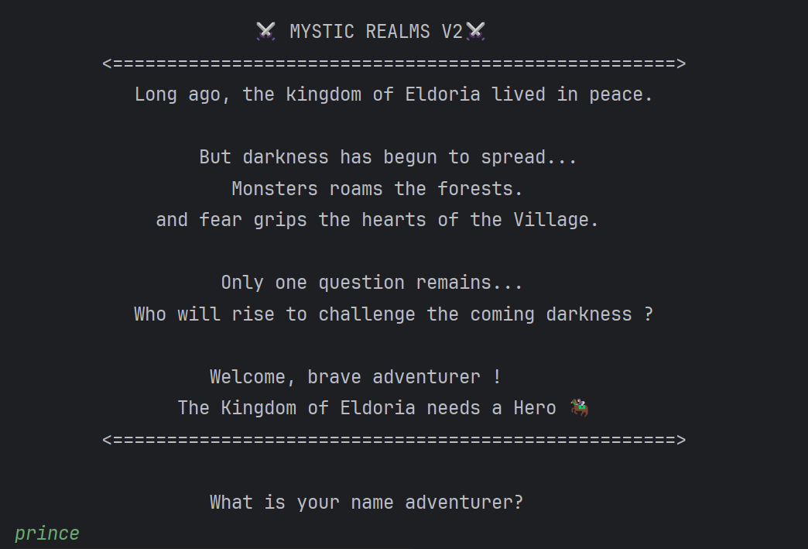
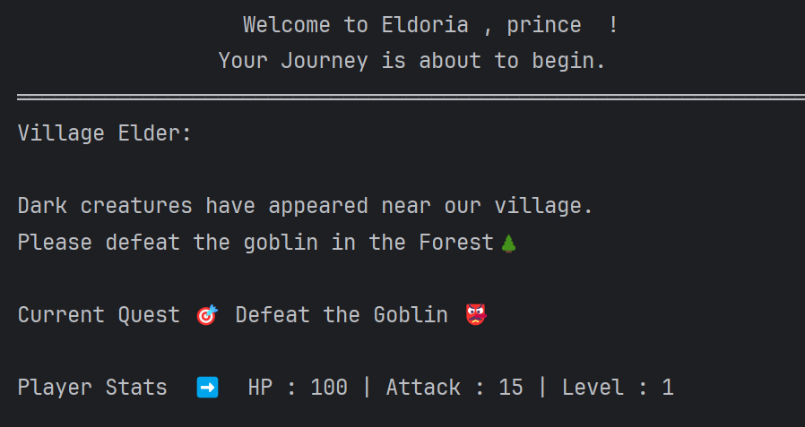
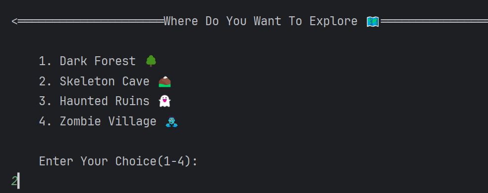
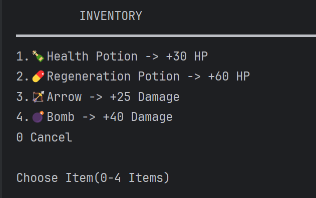
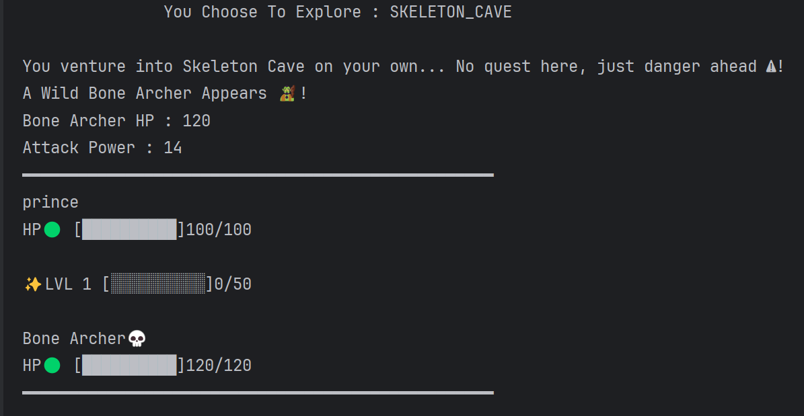
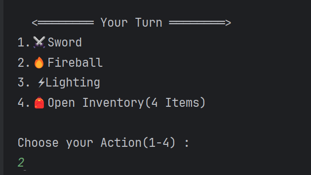
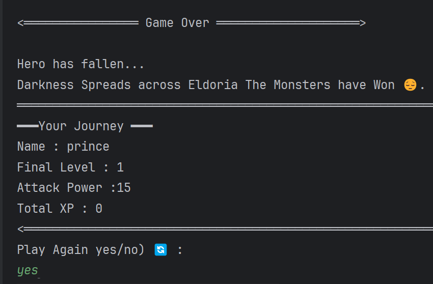

# ⚔️ Mystic Realms


> A console-based turn-based RPG game built
> with pure Kotlin. Save the kingdom of
> Eldoria from the forces of darkness!

---

## 👨‍💻 About

Hi! I'm Prince, a final year student
passionate about Android development.
This project is part of my Kotlin learning
journey before moving to Android Studio
and Jetpack Compose.

Mystic Realms started as a simple RPG and
grew into a multi-file project with real
game systems — built completely from scratch
while learning Kotlin concepts step by step.

---
## 📸 Game Features
| Feature | Screenshot |
|---------|-----------|
| **Story Intro** |  |
| **Game Start** |  |
| **Location Exploration** |  |
| **Inventory System** |  |
| **Character Stats** |  |
| **Combat System** |  |
| **Game Ending** |  |

---
## 🚀 How to Run

**Recommended:** Run this project in IntelliJ IDEA or Android Studio rather than Kotlin Playground.

1. Copy all `.kt` files from the `V1` folder into your IntelliJ IDEA or Android Studio project.
2. Open `Main.kt`.
3. Click the Run button (▶️) or use the shortcut `Shift + F10` (Windows/Linux) / `Ctrl + R` (Mac).
4. Follow the prompts in the console and provide your input as requested.

> ⚠️ **Note:** Kotlin Playground (the web-based editor) does not reliably support `readLine()` due to input timing issues, which can cause the program to crash or enter an infinite loop. For a stable experience, please run this project in IntelliJ IDEA or Android Studio.

---
## 📋 Prerequisites
- Kotlin 1.9+ 
- Java 11+ installed
- IntelliJ IDEA or Android Studio (latest)

## 🔧 Installation
1. Clone the repository: `git clone https://github.com/Prince-AppDev/Mystic-Realms.git`
2. Open in IntelliJ IDEA
3. Navigate to `V2/Main.kt`
4. Click Run or press Shift + F10

 ---
## 🎮 Gameplay Guide

**How to Play:**
1. Start the game and enter your character name
2. Choose your action:
   - **1:** Explore a location
   - **2:** Check your stats
   - **3:** View inventory
3. In combat, pick your attack (1-4)
4. Defeat monsters, gain XP, level up!
5. Game ends when your HP reaches 0
 
   ---
## 📁 Versions

### V1 — Base Version
Single file RPG with basic combat system.
```
V1/
└── Main.kt
```
**Features:**
- 🗺️ 4 locations to explore
- 👹 4 different monsters
- ⚔️ Attack, Fireball, Lightning
- 🧪 Unlimited potion healing
- 🎭 Village Elder quest storyline

---

### V2 — Major Upgrade
Multi-file architecture with advanced systems.
```
V2/
├── Main.kt      ← Entry point
├── Game.kt      ← Game logic
└── UIHelper.kt  ← UI functions
```
**What's New:**
- ❤️ Visual HP bars with colors 🟢🟡🔴
- ⭐ XP progress bar
- ⚔️ 4 random monster attack types
- 🎒 Limited inventory system
- 📈 Level up with XP thresholds
- 🎁 Level up item rewards
- 🎨 Box border UI
- 🔄 Continue exploring + play again loop
- 🏆 Dramatic story endings

---

## 🆚 V1 vs V2

| Feature | V1 | V2 |
|---------|----|----|
| 📁 Structure | Single file | Multi-file |
| ❤️ HP Display | Text only | Visual bars |
| ⚔️ Monster Attack | Fixed | 4 Random types |
| 🧪 Potions | Unlimited | Limited |
| 🎒 Inventory | None | Full system |
| 📈 Level Up | Basic | XP + Rewards |
| 🎮 UI | Plain text | Box borders |
| 🔄 Play Again | Manual rerun | Auto loop |

---

## 🧠 Kotlin Concepts Used

| Concept | Used For |
|---------|----------|
| `data class` | Player, Monster, Item |
| `enum class` | Location, AttackType, ItemType |
| `when` expression | Combat, item types |
| Higher-order functions | playerAttack() lambda |
| `MutableList` | Inventory system |
| `forEachIndexed` | Show inventory |
| `.copy()` | Update player stats |
| `.coerceAtMost()` | HP heal limit |
| `.random()` | Monster attacks |
| Null safety `?.` `?:` | readLine() handling |

---

## 🔮 V3 — Planned
- 💾 File-based save system
- 🏪 Shop with gold coins
- 😊 Difficulty levels
- 💥 Limited special attacks
- 🤝 NPC characters
  
  ---
  ## 🆘 Troubleshooting

   **Game crashes when I run it**
   - Use IntelliJ IDEA, not Kotlin Playground
   - Make sure you're running V2/Main.kt

   **Game asks for input but nothing happens**
   - The game needs keyboard input
   - Check your IntelliJ console is active

## 👨‍💻 Author

**Prince**
Final Year Student | Android Developer in Progress 🚀

---

### 📫 Connect With Me

<p align="left">
  <a href="https://linkedin.com/in/YOUR_LINKEDIN" target="_blank"></a>
  <a href="mailto:princerajput567478@gmail.com"></a>
</p>

[](https://github.com/Prince-AppDev)


